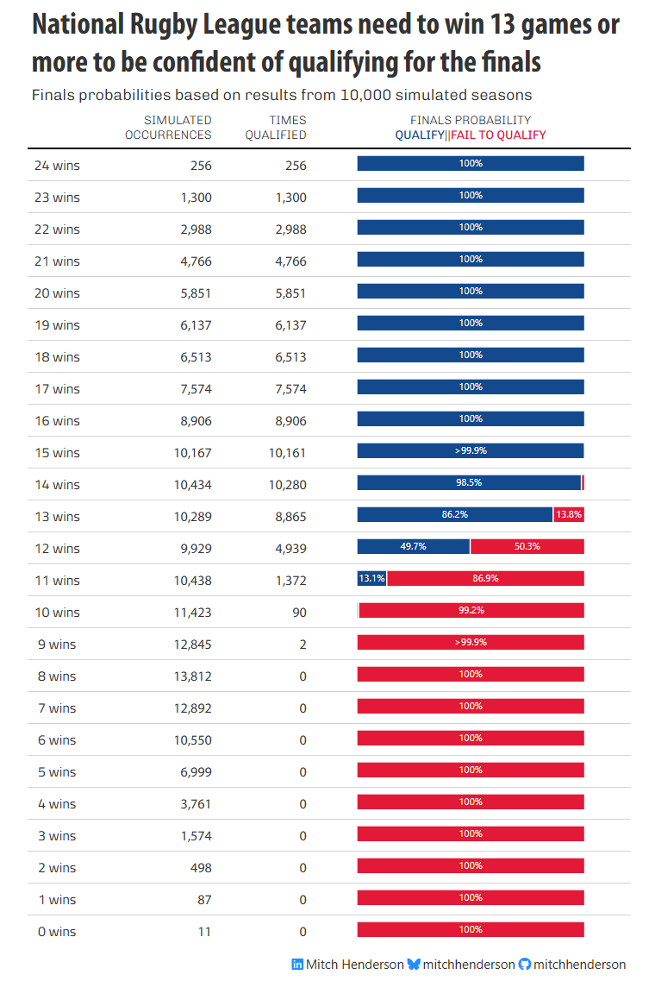

# 2025 Table Contest Submission

**Estimating NRL finals probabilities with Monte Carlo simulation**

My submission is from a sports analytics side project I did earlier in the year that estimated the probability of National Rugby League (NRL) teams qualifying for the finals based on how many matches they won in the regular season. I simulated 10,000 seasons using a Monte Carlo approach. The full post and methodology is available [on my site](https://mitchhenderson.dev/posts/2025-01-18-how-many-wins-do-nrl-teams-need-to-make-the-finals/).



## Technical Implementation

### Data
- Summarised results from my analysis (`nrl_simulated_finals_probabilities.csv`)

### Tools & Packages
- **gt**: Core table creation and formatting
- **gtExtras**: Additional features e.g. stacked bar chart
- **tidyverse**: General data manipulation and transformation
- **Custom styling**: FiveThirtyEight theme with custom fonts and colours

## Code Structure

```
create_table.R          # Table creation script
nrl_simulated_finals_probabilities.csv  # Data
table.html             # Generated HTML output
table.png              # Static image version
renv.lock              # Package management
```

## Reproducibility

This project uses `renv` for package management to ensure consistent results across different environments.

### Prerequisites

- **R version 4.4.0 or higher** (this project was developed with R 4.4.0)
- Git (to clone the repository)

### Step-by-step instructions

1. **Clone the repository**
   ```bash
   git clone https://github.com/mitchhenderson/2025-Table-Content
   cd 2025-Table-Contest
   ```

2. **Restore the package environment**
   ```r
   # Install renv if not already installed
   if (!requireNamespace("renv", quietly = TRUE)) {
     install.packages("renv")
   }

   # Restore all project dependencies
   renv::restore()
   ```
   This will automatically install all required packages (gt, gtExtras, tidyverse, etc.) at the exact versions I used.

3. **Run the script**
   ```r
   source("create_table.R")
   ```

### Output

After running the script, **`table.html`** will be generated containing an HTML version of the table.

The `table` object will also be available in your R environment and display in the Viewer pane of Positron or RStudio.

---

*Created for the 2025 Table Contest using R, gt, and gtExtras*
